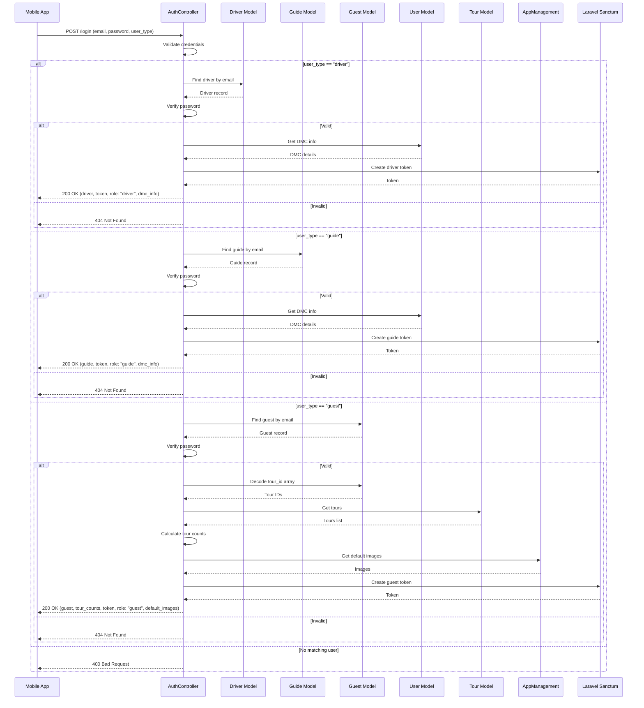

# Authentication Login Flow - Simple Sequence Diagram

Clean and simple sequence diagram for authentication.

## How to View
1. Open this file in VS Code
2. Press `Ctrl+Shift+V` (or right-click → Open Preview)
3. Or copy the Mermaid code to [Mermaid Live Editor](https://mermaid.live/)

---

## Login Flow (All User Types)

