# Complete Driver Flow - Master Sequence Diagram

This is a comprehensive sequence diagram showing the complete driver workflow from authentication to all operations.

## How to View
1. Open this file in VS Code
2. Press `Ctrl+Shift+V` (or right-click → Open Preview)
3. Or copy the Mermaid code to [Mermaid Live Editor](https://mermaid.live/)

```mermaid
%%{init: {
  "theme": "base",
  "themeVariables": {
    "primaryColor": "#ff7f0e",
    "secondaryColor": "#1f77b4",
    "tertiaryColor": "#9467bd",
    "quaternaryColor": "#2ca02c",
    "primaryTextColor": "#ffffff",
    "lineColor": "#555555",
    "noteBkgColor": "#fffacd",
    "noteTextColor": "#000000"
  }
}}%%
sequenceDiagram
    actor Driver as 🚗 Driver App
    participant Auth as AuthController
    participant Middleware as Auth Middleware
    participant DriverModel as Driver Model
    participant User as User Model
    participant Sanctum as Laravel Sanctum
    participant Jobsheet as Jobsheet Model
    participant Tour as Tour Model
    participant Order as Order Model
    participant Vehicle as Vehicle Model
    participant Guest as Guest Model
    participant NotifHelper as NotificationHelper
    participant Firebase as Firebase Realtime DB<br/>& Messaging
    participant GuestDevices as 📱 Guest Devices

    rect rgba(255,127,14,0.2)
        Note over Driver,Sanctum: 1. LOGIN FLOW
        Driver->>Auth: POST /login<br/>(email, password, user_type: "driver")
        Auth->>DriverModel: Driver::where('email', email)->first()
        DriverModel-->>Auth: Driver record
        Auth->>Auth: Hash::check(password, app_password)
        alt Valid credentials
            Auth->>User: User::where('userId', dmc_id)
            User-->>Auth: DMC info
            Auth->>Sanctum: driver->createToken('driver-token')
            Sanctum-->>Auth: plainTextToken
            Auth-->>Driver: 200 OK<br/>{driver, token, role: "driver", dmc_info}
        else Invalid credentials
            Auth-->>Driver: 404 Not Found
        end
    end

    rect rgba(31,119,180,0.2)
        Note over Driver,Vehicle: 2. GET TODAY'S JOBSHEETS
        Driver->>Auth: GET /driver/jobsheets<br/>(Authorization: Bearer token)
        Auth->>Middleware: Verify token & get driver_id
        Middleware-->>Auth: Authenticated driver
        Auth->>Auth: Verify auth_user->driver_id == driver_id
        
        alt Authorized
            Auth->>Jobsheet: Jobsheet::where('driver_id', driver_id)<br/>->where('date', today())<br/>->whereHas('tour', status: Confirmed/Definite/Actual)
            Jobsheet-->>Auth: Jobsheets list
            
            loop For each jobsheet
                alt Has order_id
                    Auth->>Order: Order::where('booking_id', order_id)
                    Order-->>Auth: Order data
                    Auth->>Tour: Tour::where('tour_id', order->tour_id)
                    Tour-->>Auth: Tour details (infant, male_count, female_count)
                    Auth->>Auth: Extract order_details from order->data
                end
                
                alt Has vehicle_id
                    Auth->>Vehicle: Vehicle::where('vehicle_id', vehicle_id)
                    Vehicle-->>Auth: Vehicle details
                end
            end
            
            Auth->>Jobsheet: Extract unique tour_ids
            loop For each tour_id
                Auth->>Order: Order::where('tour_id', tourId)->first()
                Order-->>Auth: First order data
                Auth->>Guest: Guest::where('email', email)
                Guest-->>Auth: Guest record (share_contact, whatsapp_no)
                Auth->>Auth: Build customer_info array
            end
            
            Auth-->>Driver: 200 OK<br/>{jobsheets, customer_info, total_jobsheets}
        else Unauthorized
            Auth-->>Driver: 401 Unauthorized
        end
    end

    rect rgba(148,103,189,0.2)
        Note over Driver,GuestDevices: 3. UPDATE JOBSHEET STATUS (with Notifications)
        Driver->>Auth: POST /jobsheet/update-status<br/>{id, status, reach_time, comments}
        Auth->>Auth: Validate request (id, status)
        Auth->>Jobsheet: Jobsheet::where('jobsheet_id', id)->first()
        Jobsheet-->>Auth: Jobsheet record
        
        alt Jobsheet found
            Auth->>Auth: Map status (1=started, 2=arrived,<br/>3=picked, 4=completed)
            Auth->>Jobsheet: Update current_status, reach_time, comments
            Jobsheet->>Jobsheet: Save changes
            
            Auth->>Guest: Guest::whereJsonContains('tour_id', tour_id)<br/>->pluck('email')
            Guest-->>Auth: Guest emails array
            
            alt Guest emails exist
                Auth->>DriverModel: Driver::where('driver_id', driver_id)
                DriverModel-->>Auth: Driver details (name)
                
                Auth->>Vehicle: Vehicle::where('vehicle_id', vehicle_id)
                Vehicle-->>Auth: Vehicle details (name, number, color)
                
                Auth->>Order: Order::where('booking_id', order_id)
                Order-->>Auth: Order data
                Auth->>Auth: Extract pickup/drop locations from order->data
                
                Auth->>Auth: Build notification title & body<br/>(Status, Driver, Vehicle, Locations, Comments)
                Auth->>Auth: Build data payload<br/>{type: "jobsheet_update", jobsheet_id,<br/>status, tour_id, driver_name, vehicle_name,<br/>vehicle_number, vehicle_color, pickup_location,<br/>drop_location, comments}
                
                Auth->>NotifHelper: sendNotificationToGuest(emails,<br/>title, body, null, dataPayload)
                
                loop For each email
                    NotifHelper->>Firebase: Get user_tokens/{base64(email)}
                    Firebase-->>NotifHelper: Device tokens array
                    NotifHelper->>Firebase: sendMulticast(message, tokens)
                    Firebase-->>NotifHelper: Report (successes, failures)
                    
                    loop For each failure
                        alt Invalid token
                            NotifHelper->>Firebase: Remove token from database
                        end
                    end
                end
                
                Firebase-->>GuestDevices: Push notification delivered
                NotifHelper-->>Auth: Notification result
            end
            
            Auth-->>Driver: 200 OK<br/>{success: true, message, data: jobsheet}
        else Jobsheet not found
            Auth-->>Driver: 404 Not Found
        end
    end

    rect rgba(255,127,14,0.2)
        Note over Driver,Guest: 4. GET UPCOMING TOURS
        Driver->>Auth: GET /upcoming-tours<br/>{user_type: "driver", date?}
        Auth->>Middleware: Verify token & get driver_id
        Middleware-->>Auth: Authenticated driver
        Auth->>Auth: Verify auth_user->driver_id == driver_id
        
        alt Authorized
            Auth->>Auth: Determine filter date<br/>(default: tomorrow)
            Auth->>Jobsheet: Jobsheet::where('driver_id', driver_id)<br/>->where('date', dateToFilter)<br/>->whereHas('tour', status: Confirmed/Definite/Actual)
            Jobsheet-->>Auth: Jobsheets list
            
            loop For each jobsheet
                alt Has order_id
                    Auth->>Order: Order::where('booking_id', order_id)
                    Order-->>Auth: Order data
                    Auth->>Tour: Tour::where('tour_id', order->tour_id)
                    Tour-->>Auth: Tour details
                    Auth->>Auth: Extract order_details
                end
                
                alt Has vehicle_id
                    Auth->>Vehicle: Vehicle::where('vehicle_id', vehicle_id)
                    Vehicle-->>Auth: Vehicle details
                end
            end
            
            Auth->>Jobsheet: Extract unique tour_ids
            loop For each tour_id
                Auth->>Order: Order::where('tour_id', tourId)->first()
                Order-->>Auth: First order data
                Auth->>Guest: Guest::whereJsonContains('tour_id', tourId)<br/>->where('email', email)
                Guest-->>Auth: Guest record
                Auth->>Auth: Build customer_info array
            end
            
            Auth-->>Driver: 200 OK<br/>{jobsheets, customer_info, total_jobsheets}
        else Unauthorized
            Auth-->>Driver: 401 Unauthorized
        end
    end

    rect rgba(200,200,200,0.2)
        Note over Driver,DriverModel: 5. UPDATE PASSWORD
        Driver->>Auth: POST /driver/update<br/>{password}
        Auth->>Middleware: Verify token & get driver
        Middleware-->>Auth: Authenticated driver
        Auth->>Auth: Hash::make(password)
        Auth->>DriverModel: driver->app_password = hashed_password
        DriverModel->>DriverModel: Save changes
        DriverModel->>DriverModel: Refresh from database
        Auth-->>Driver: 200 OK<br/>{success: true, message, data: driver}
    end
```

## Flow Overview

1. **Login Flow**: Driver authenticates with email/password, receives Sanctum token
2. **Get Today's Jobsheets**: Retrieves today's jobsheets with vehicle and order details
3. **Update Jobsheet Status**: Updates status and sends push notifications to guests via Firebase
4. **Get Upcoming Tours**: Retrieves upcoming tours for a specific date (default: tomorrow)
5. **Update Password**: Changes driver password securely

## Key Interactions

- **Authentication**: Token-based using Laravel Sanctum
- **Authorization**: Middleware verifies driver_id matches authenticated user
- **Vehicle Integration**: Fetches vehicle details for each jobsheet
- **Notifications**: Firebase Cloud Messaging for real-time push notifications with vehicle and driver info
