# Complete Guest Flow - Master Sequence Diagram

This is a comprehensive sequence diagram showing the complete guest workflow from authentication to all operations.

## How to View
1. Open this file in VS Code
2. Press `Ctrl+Shift+V` (or right-click → Open Preview)
3. Or copy the Mermaid code to [Mermaid Live Editor](https://mermaid.live/)

```mermaid
%%{init: {
  "theme": "base",
  "themeVariables": {
    "primaryColor": "#d62728",
    "secondaryColor": "#1f77b4",
    "tertiaryColor": "#ff7f0e",
    "quaternaryColor": "#2ca02c",
    "primaryTextColor": "#ffffff",
    "lineColor": "#555555",
    "noteBkgColor": "#fffacd",
    "noteTextColor": "#000000"
  }
}}%%
sequenceDiagram
    actor Guest as 👤 Guest App
    participant Auth as AuthController
    participant Middleware as Auth Middleware
    participant GuestModel as Guest Model
    participant Tour as Tour Model
    participant Sanctum as Laravel Sanctum
    participant AppMgmt as AppManagement
    participant Order as Order Model
    participant Agent as Agent Model
    participant Agency as Agency Model
    participant Hotel as Hotel Model
    participant Attraction as Attraction Model
    participant Vehicle as Vehicle Model
    participant Driver as Driver Model
    participant Restaurant as Restaurant Model
    participant Guide as Guide Model
    participant GuideLang as GuideLanguage Model
    participant Country as Country Model
    participant City as City Model
    participant CityExp as CityExploration Model
    participant DB as Database

    rect rgba(214,39,40,0.2)
        Note over Guest,Sanctum: 1. LOGIN FLOW
        Guest->>Auth: POST /login<br/>(email, password, user_type: "guest")
        Auth->>GuestModel: Guest::where('email', email)->first()
        GuestModel-->>Auth: Guest record
        Auth->>Auth: Hash::check(password, app_password)
        alt Valid credentials
            Auth->>GuestModel: Decode tour_id JSON array
            GuestModel-->>Auth: tour_id array
            Auth->>Tour: Tour::whereIn('tour_id', tourIds)->get()
            Tour-->>Auth: Tours list
            Auth->>Auth: Calculate tour counts<br/>(past, ongoing, upcoming)
            Auth->>AppMgmt: AppManagement::select('past_image',<br/>'ongoing_image', 'upcoming_image')
            AppMgmt-->>Auth: Default images
            Auth->>Sanctum: guest->createToken('guest-token')
            Sanctum-->>Auth: plainTextToken
            Auth-->>Guest: 200 OK<br/>{guest, tour_counts, token,<br/>role: "guest", default_images}
        else Invalid credentials
            Auth-->>Guest: 404 Not Found
        end
    end

    rect rgba(31,119,180,0.2)
        Note over Guest,Country: 2. GET GUEST BOOKINGS
        Guest->>Auth: GET /guest/bookings<br/>{status_type: past/ongoing/upcoming}
        Auth->>Middleware: Verify token & get guest
        Middleware-->>Auth: Authenticated guest
        
        Auth->>GuestModel: Decode guest->tour_id JSON array
        GuestModel-->>Auth: tour_id array
        
        Auth->>Tour: Tour::whereIn('tour_id', tourIds)<br/>->whereIn('tour_status', ['Definite', 'Actual'])<br/>->where(check_in/check_out based on status_type)
        Tour-->>Auth: Filtered tours list
        
        loop For each tour
            Auth->>Agent: Agent::where('agent_id', tour->agent_id)
            Agent-->>Auth: Agent record
            Auth->>Agency: Agency::where('agency_id', agent->agency_id)
            Agency-->>Auth: Agency details (name, phone, email, wp_number)
            
            Auth->>Order: Order::where('tour_id', tour->tour_id)
            Order-->>Auth: Orders list
            
            loop For each order
                Auth->>Auth: Decode order->data JSON
                
                alt order->type == "hotel"
                    Auth->>Hotel: Hotel::where('hotel_unique_id', hotel_id)
                    Hotel-->>Auth: Hotel details (city, main_image, phone)
                    
                else order->type == "attraction"
                    Auth->>Attraction: Attraction::where('attraction_id', attractionId)
                    Attraction-->>Auth: Attraction details (location, master_image, phone)
                    
                else order->type == "travel_point/entry_port/etc"
                    Auth->>DB: Get jobsheet (vehicle_id, driver_id, comments)
                    DB-->>Auth: Jobsheet data
                    alt Has vehicle_id
                        Auth->>Vehicle: Vehicle::where('vehicle_id', vehicle_id)
                        Vehicle-->>Auth: Vehicle details
                    end
                    alt Has driver_id
                        Auth->>Driver: Driver::where('driver_id', driver_id)
                        Driver-->>Auth: Driver details (name, phone, wp_number, image)
                    end
                    
                else order->type == "restaurant"
                    Auth->>Restaurant: Restaurant::where('restaurant_id', restaurantId)
                    Restaurant-->>Auth: Restaurant details (city, master_image, phone)
                    
                else order->type == "guide"
                    Auth->>DB: Get jobsheet (guide_id, comments)
                    DB-->>Auth: Jobsheet data
                    alt Has guide_id
                        Auth->>Guide: Guide::where('guide_id', guide_id)
                        Guide-->>Auth: Guide details
                        Auth->>GuideLang: GuideLanguage::where('guide_id', guide_id)
                        GuideLang-->>Auth: Languages array
                    end
                    
                else order->type == "attraction_package"
                    Auth->>DB: Get packaged_attraction
                    DB-->>Auth: Packaged attraction with attractions array
                    Auth->>Attraction: Get first attraction location
                    Attraction-->>Auth: City/location
                end
                
                Auth->>Auth: Attach order type specific info
            end
            
            Auth->>Country: Country::where('name', tour->destination)
            Country-->>Auth: Country image
            Auth->>Auth: Build tour data with orders,<br/>agency info, destination_image
        end
        
        Auth-->>Guest: 200 OK<br/>{tours, total_tours}
    end

    rect rgba(255,127,14,0.2)
        Note over Guest,GuestModel: 3. UPDATE PASSWORD
        Guest->>Auth: POST /guest/update<br/>{password}
        Auth->>Middleware: Verify token & get guest
        Middleware-->>Auth: Authenticated guest
        Auth->>Auth: Hash::make(password)
        Auth->>GuestModel: guest->app_password = hashed_password
        GuestModel->>GuestModel: Save changes
        GuestModel->>GuestModel: Refresh from database
        Auth-->>Guest: 200 OK<br/>{success: true, message, data: guest}
    end

    rect rgba(44,160,44,0.2)
        Note over Guest,GuestModel: 4. SHARE CONTACT STATUS UPDATE
        Guest->>Auth: POST /guest/share-contact<br/>{email, guest_id, share_status}
        Auth->>Auth: Validate request
        Auth->>GuestModel: Guest::where('guest_id', guest_id)<br/>->where('email', email)->first()
        GuestModel-->>Auth: Guest record or null
        
        alt Guest found & share_status valid
            Auth->>GuestModel: guest->share_contact = share_status
            GuestModel->>GuestModel: Save changes
            Auth-->>Guest: 200 OK<br/>{success: true, message, data: guest}
        else Guest not found
            Auth-->>Guest: 404 Not Found
        else Share status is null
            Auth-->>Guest: 400 Bad Request
        end
    end

    rect rgba(148,103,189,0.2)
        Note over Guest,CityExp: 5. EXPLORE CITIES
        Guest->>Auth: GET /explore-cities<br/>{country, city}
        Auth->>City: City::where('country', country)->first()
        City-->>Auth: City record (city_id, name, image)
        Auth->>CityExp: CityExploration::where('city_id', city_id)->first()
        CityExp-->>Auth: CityExploration record or null
        
        alt City exploration found
            Auth-->>Guest: 200 OK<br/>{success: true, data: city_exploration}
        else City exploration not found
            Auth-->>Guest: 404 Not Found
        end
    end
```

## Flow Overview

1. **Login Flow**: Guest authenticates with email/password, receives Sanctum token and tour counts
2. **Get Guest Bookings**: Retrieves bookings filtered by status (past/ongoing/upcoming) with rich order details
3. **Update Password**: Changes guest password securely
4. **Share Contact Status**: Updates privacy setting for contact sharing with drivers/guides
5. **Explore Cities**: Retrieves city exploration information

## Key Interactions

- **Authentication**: Token-based using Laravel Sanctum
- **Tour Filtering**: Filters tours by check_in_time and check_out_time
- **Order Type Handling**: Different logic for hotels, attractions, transport, restaurants, guides, and packages
- **Rich Data Aggregation**: Combines data from multiple models (Tour, Order, Agency, Hotel, Vehicle, Driver, Guide, etc.)
- **Privacy Control**: Guest controls contact sharing via share_contact field
