# Complete Guide Flow - Master Sequence Diagram

This is a comprehensive sequence diagram showing the complete guide workflow from authentication to all operations.

## How to View
1. Open this file in VS Code
2. Press `Ctrl+Shift+V` (or right-click → Open Preview)
3. Or copy the Mermaid code to [Mermaid Live Editor](https://mermaid.live/)

```mermaid
%%{init: {
  "theme": "base",
  "themeVariables": {
    "primaryColor": "#2ca02c",
    "secondaryColor": "#1f77b4",
    "tertiaryColor": "#9467bd",
    "quaternaryColor": "#ff7f0e",
    "primaryTextColor": "#ffffff",
    "lineColor": "#555555",
    "noteBkgColor": "#fffacd",
    "noteTextColor": "#000000"
  }
}}%%
sequenceDiagram
    actor Guide as 🧭 Guide App
    participant Auth as AuthController
    participant Middleware as Auth Middleware
    participant GuideModel as Guide Model
    participant User as User Model
    participant Sanctum as Laravel Sanctum
    participant Jobsheet as Jobsheet Model
    participant Tour as Tour Model
    participant Order as Order Model
    participant Guest as Guest Model
    participant GuideLang as GuideLanguage Model
    participant NotifHelper as NotificationHelper
    participant Firebase as Firebase Realtime DB<br/>& Messaging
    participant GuestDevices as 📱 Guest Devices

    rect rgba(44,160,44,0.2)
        Note over Guide,Sanctum: 1. LOGIN FLOW
        Guide->>Auth: POST /login<br/>(email, password, user_type: "guide")
        Auth->>GuideModel: Guide::where('email', email)->first()
        GuideModel-->>Auth: Guide record
        Auth->>Auth: Hash::check(password, app_password)
        alt Valid credentials
            Auth->>User: User::where('userId', dmc_id)
            User-->>Auth: DMC info
            Auth->>Sanctum: guide->createToken('guide-token')
            Sanctum-->>Auth: plainTextToken
            Auth-->>Guide: 200 OK<br/>{guide, token, role: "guide", dmc_info}
        else Invalid credentials
            Auth-->>Guide: 404 Not Found
        end
    end

    rect rgba(31,119,180,0.2)
        Note over Guide,Jobsheet: 2. GET TODAY'S JOBSHEETS
        Guide->>Auth: GET /guide/jobsheets<br/>(Authorization: Bearer token)
        Auth->>Middleware: Verify token & get guide_id
        Middleware-->>Auth: Authenticated guide
        Auth->>Auth: Verify auth_user->guide_id == guide_id
        
        alt Authorized
            Auth->>Jobsheet: Jobsheet::where('guide_id', guide_id)<br/>->where('date', today())<br/>->whereHas('tour', status: Confirmed/Definite/Actual)
            Jobsheet-->>Auth: Jobsheets list
            
            loop For each jobsheet
                alt Has order_id
                    Auth->>Order: Order::where('booking_id', order_id)
                    Order-->>Auth: Order data
                    Auth->>Tour: Tour::where('tour_id', order->tour_id)
                    Tour-->>Auth: Tour details
                    Auth->>Auth: Extract order_details
                end
            end
            
            Auth->>Jobsheet: Extract unique tour_ids
            loop For each tour_id
                Auth->>Order: Order::where('tour_id', tourId)->first()
                Order-->>Auth: First order data
                Auth->>Guest: Guest::whereJsonContains('tour_id', tourId)<br/>->where('email', email)
                Guest-->>Auth: Guest record (share_contact, whatsapp_no)
                Auth->>Auth: Build customer_info array
            end
            
            Auth-->>Guide: 200 OK<br/>{jobsheets, customer_info, total_jobsheets}
        else Unauthorized
            Auth-->>Guide: 401 Unauthorized
        end
    end

    rect rgba(148,103,189,0.2)
        Note over Guide,GuestDevices: 3. UPDATE JOBSHEET STATUS (with Notifications)
        Guide->>Auth: POST /jobsheet/update-status<br/>{id, status, reach_time, comments}
        Auth->>Auth: Validate request (id, status)
        Auth->>Jobsheet: Jobsheet::where('jobsheet_id', id)->first()
        Jobsheet-->>Auth: Jobsheet record
        
        alt Jobsheet found
            Auth->>Auth: Map status (1=started, 2=arrived, 3=completed)
            Auth->>Jobsheet: Update current_status, reach_time, comments
            Jobsheet->>Jobsheet: Save changes
            
            Auth->>Guest: Guest::whereJsonContains('tour_id', tour_id)<br/>->pluck('email')
            Guest-->>Auth: Guest emails array
            
            alt Guest emails exist
                Auth->>GuideModel: Guide::where('guide_id', guide_id)
                GuideModel-->>Auth: Guide details (name)
                
                Auth->>GuideLang: GuideLanguage::where('guide_id', guide_id)<br/>->pluck('language')
                GuideLang-->>Auth: Guide languages array
                
                Auth->>Auth: Build notification title & body<br/>(Status, Guide Name, Languages, Comments)
                Auth->>Auth: Build data payload<br/>{type: "jobsheet_update", jobsheet_id,<br/>status, tour_id, guide_name,<br/>guide_languages, comments}
                
                Auth->>NotifHelper: sendNotificationToGuest(emails,<br/>title, body, null, dataPayload)
                
                loop For each email
                    NotifHelper->>Firebase: Get user_tokens/{base64(email)}
                    Firebase-->>NotifHelper: Device tokens array
                    NotifHelper->>Firebase: sendMulticast(message, tokens)
                    Firebase-->>NotifHelper: Report (successes, failures)
                    
                    loop For each failure
                        alt Invalid token
                            NotifHelper->>Firebase: Remove token from database
                        end
                    end
                end
                
                Firebase-->>GuestDevices: Push notification delivered
                NotifHelper-->>Auth: Notification result
            end
            
            Auth-->>Guide: 200 OK<br/>{success: true, message, data: jobsheet}
        else Jobsheet not found
            Auth-->>Guide: 404 Not Found
        end
    end

    rect rgba(255,127,14,0.2)
        Note over Guide,Guest: 4. GET UPCOMING TOURS
        Guide->>Auth: GET /upcoming-tours<br/>{user_type: "guide", date?}
        Auth->>Middleware: Verify token & get guide_id
        Middleware-->>Auth: Authenticated guide
        Auth->>Auth: Verify auth_user->guide_id == guide_id
        
        alt Authorized
            Auth->>Auth: Determine filter date<br/>(default: tomorrow)
            Auth->>Jobsheet: Jobsheet::where('guide_id', guide_id)<br/>->where('date', dateToFilter)<br/>->whereHas('tour', status: Confirmed/Definite/Actual)
            Jobsheet-->>Auth: Jobsheets list
            
            loop For each jobsheet
                alt Has order_id
                    Auth->>Order: Order::where('booking_id', order_id)
                    Order-->>Auth: Order data
                    Auth->>Tour: Tour::where('tour_id', order->tour_id)
                    Tour-->>Auth: Tour details
                    Auth->>Auth: Extract order_details
                end
            end
            
            Auth->>Jobsheet: Extract unique tour_ids
            loop For each tour_id
                Auth->>Order: Order::where('tour_id', tourId)->first()
                Order-->>Auth: First order data
                Auth->>Guest: Guest::whereJsonContains('tour_id', tourId)<br/>->where('email', email)
                Guest-->>Auth: Guest record
                Auth->>Auth: Build customer_info array
            end
            
            Auth-->>Guide: 200 OK<br/>{jobsheets, customer_info, total_jobsheets}
        else Unauthorized
            Auth-->>Guide: 401 Unauthorized
        end
    end

    rect rgba(200,200,200,0.2)
        Note over Guide,GuideModel: 5. UPDATE PASSWORD
        Guide->>Auth: POST /guide/update<br/>{password}
        Auth->>Middleware: Verify token & get guide
        Middleware-->>Auth: Authenticated guide
        Auth->>Auth: Hash::make(password)
        Auth->>GuideModel: guide->app_password = hashed_password
        GuideModel->>GuideModel: Save changes
        GuideModel->>GuideModel: Refresh from database
        Auth-->>Guide: 200 OK<br/>{success: true, message, data: guide}
    end
```

## Flow Overview

1. **Login Flow**: Guide authenticates with email/password, receives Sanctum token
2. **Get Today's Jobsheets**: Retrieves today's jobsheets with order details and customer info
3. **Update Jobsheet Status**: Updates status and sends push notifications to guests via Firebase
4. **Get Upcoming Tours**: Retrieves upcoming tours for a specific date (default: tomorrow)
5. **Update Password**: Changes guide password securely

## Key Interactions

- **Authentication**: Token-based using Laravel Sanctum
- **Authorization**: Middleware verifies guide_id matches authenticated user
- **Notifications**: Firebase Cloud Messaging for real-time push notifications
- **Data Aggregation**: Combines data from multiple models (Jobsheet, Order, Tour, Guest)
