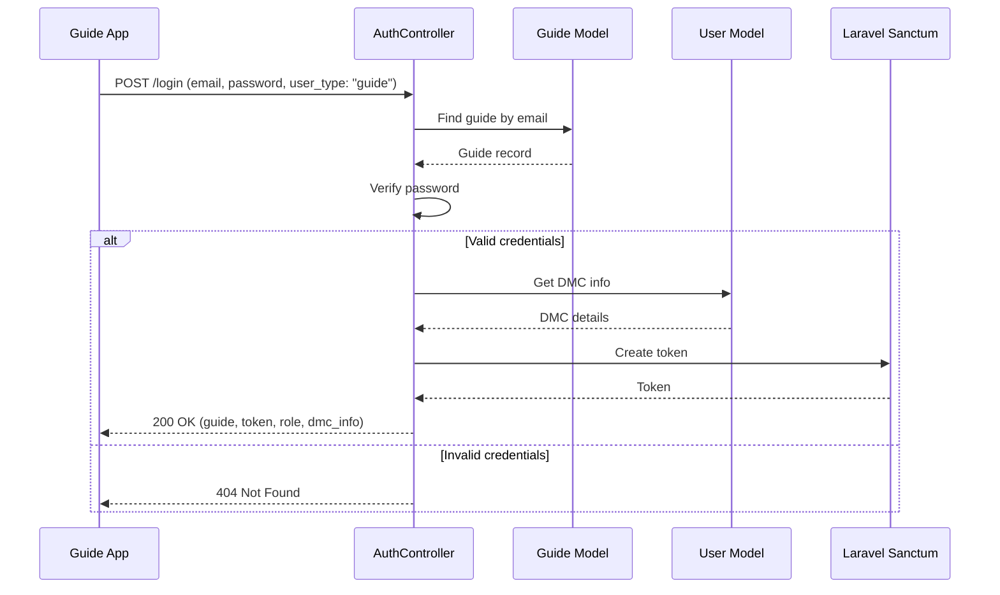
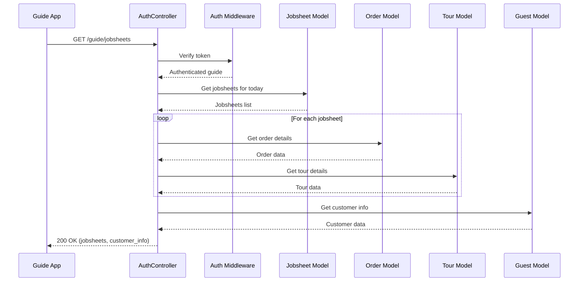
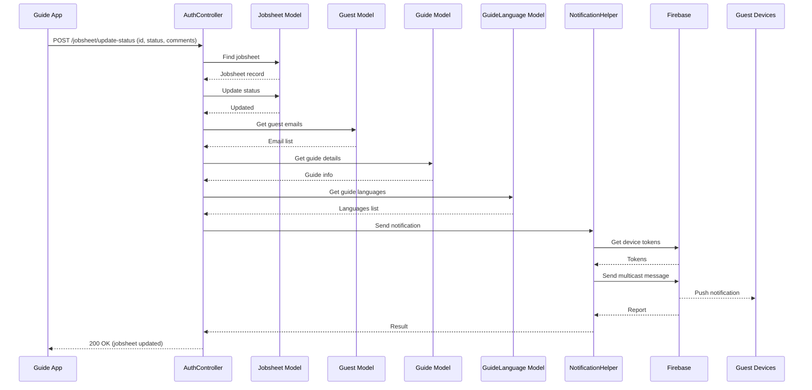
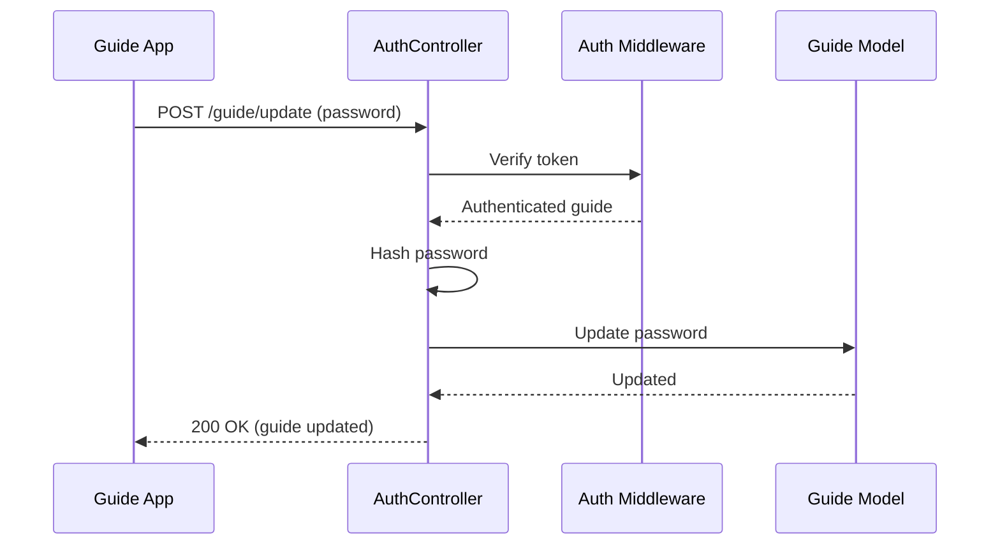

# Guide Flow - Simple Sequence Diagrams

Clean and simple sequence diagrams for guide operations.

## How to View
1. Open this file in VS Code
2. Press `Ctrl+Shift+V` (or right-click → Open Preview)
3. Or copy the Mermaid code to [Mermaid Live Editor](https://mermaid.live/)

---

## 1. Guide Login

---

## 2. Get Guide Jobsheets

---

## 3. Update Jobsheet Status with Notifications

---

## 4. Get Upcoming Tours

---

## 5. Update Guide Password

